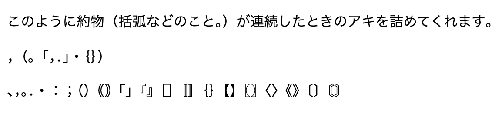

# 約組フォント / Yaku Kumi Fonts

[](https://www.jsdelivr.com/package/gh/daiji256/yaku-kumi-fonts)



約組フォント（Yaku Kumi Fonts）は、Noto Sans/Serif JP をベースにした約物専用の Web フォントです。約物が連続する際に生じるアキを OpenType 機能 `chws` で調整します。

[notofonts/noto-cjk](https://github.com/notofonts/noto-cjk/tree/985fa52c81c1d6692ccdd82bc3656e8fb932fd89/google-fonts) の google-fonts にある `NotoSansJP[wght].ttf` および `NotoSerifJP[wght].ttf` をサブセット化して生成しています。

収録している約物は次のとおりです：

```
、，。．・：；（）｟｠「」『』［］〚〛｛｝【】〖〗〈〉《》〔〕〘〙
```

対応しているウェイトは次のとおりです：

| フォント | 対応ウェイト                                |
| -------- | ------------------------------------------- |
| Sans     | 100, 200, 300, 400, 500, 600, 700, 800, 900 |
| Serif    | 200, 300, 400, 500, 600, 700, 800, 900      |

# 利用方法

利用したいフォントとウェイトの組み合わせに応じて、読み込む CSS を選択してください。フォントファミリー名は `Yaku Kumi Sans` と `Yaku Kumi Serif` です。

| フォント    | ウェイト | URL                                                                                       |
| ----------- | -------- | ----------------------------------------------------------------------------------------- |
| Sans, Serif | すべて   | https://cdn.jsdelivr.net/gh/daiji256/yaku-kumi-fonts@2.0.0/css/yakukumi.min.css           |
| Sans        | すべて   | https://cdn.jsdelivr.net/gh/daiji256/yaku-kumi-fonts@2.0.0/css/yakukumi-sans-all.min.css  |
|             | 400, 700 | https://cdn.jsdelivr.net/gh/daiji256/yaku-kumi-fonts@2.0.0/css/yakukumi-sans-rb.min.css   |
|             | 400      | https://cdn.jsdelivr.net/gh/daiji256/yaku-kumi-fonts@2.0.0/css/yakukumi-sans-r.min.css    |
| Serif       | すべて   | https://cdn.jsdelivr.net/gh/daiji256/yaku-kumi-fonts@2.0.0/css/yakukumi-serif-all.min.css |
|             | 400, 700 | https://cdn.jsdelivr.net/gh/daiji256/yaku-kumi-fonts@2.0.0/css/yakukumi-serif-rb.min.css  |
|             | 400      | https://cdn.jsdelivr.net/gh/daiji256/yaku-kumi-fonts@2.0.0/css/yakukumi-serif-r.min.css   |

たとえば、Yaku Kumi Sans の Regular (400) と Bold (700) を読み込む場合：

```html
<link
  rel="stylesheet"
  href="https://cdn.jsdelivr.net/gh/daiji256/yaku-kumi-fonts@2.0.0/css/yakukumi-sans-rb.min.css"
/>
```

CSS で `font-family` を設定し、OpenType 機能 `chws` を有効にします：

```css
font-family: "Yaku Kumi Sans", "Noto Sans JP", sans-serif;
font-feature-settings: "chws" 1;
```

# 注意事項

- このフォントは約物（句読点や括弧類など）のみを収録しています。本文用の日本語フォントは別途指定してください。
- OpenType 機能 `chws` を有効にして使用します。対応状況はブラウザやレンダリング環境に依存します。

# ライセンス

- フォント: SIL Open Font License 1.1
- スクリプトなどのフォント以外: MIT License
