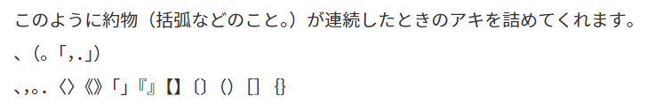

# 約組フォント / Yaku Kumi Fonts

[](https://www.jsdelivr.com/package/gh/daiji256/yaku-kumi-fonts)



約組フォント（Yaku Kumi Fonts）は，Noto CJK を元に作成した，約物が連続したときのアキを `chws` で調整する 約物専用 Web フォントです。

Android 12 から Noto CJK に `chws` による約物のアキを詰める修正がされたため，約物をサブセットして作成しました。詳しくは [simonsmh/notocjk](https://github.com/simonsmh/notocjk) を参考にしてください。

# 利用方法 / CDN

利用したいフォント（Sans か Serif）とウェイトから，読み込む CSS を選んでください。ウェイトは Google Fonts の Noto Sans/Serif Japanese と同じものがあります。フォント名は `"Yaku Kumi Sans"` と `"Yaku Kumi Serif"` になっています。収録フォントは `、，。．・：；（）｟｠「」『』［］〚〛｛｝【】〖〗〈〉《》〔〕〘〙` です。

|フォント|対応ウェイト                     |
|--------|---------------------------------|
|Sans    |100, 300, 400, 500, 700, 900     |
|Serif   |200, 300, 400, 500, 600, 700, 900|

|フォント   |ウェイト|URL                                                                                     |
|-----------|--------|----------------------------------------------------------------------------------------|
|Sans, Serif|全て    |https://cdn.jsdelivr.net/gh/daiji256/yaku-kumi-fonts@v1.2/css/yakukumi.min.css          |
|Sans       |全て    |https://cdn.jsdelivr.net/gh/daiji256/yaku-kumi-fonts@v1.2/css/yakukumi-sans-all.min.css |
|           |400, 700|https://cdn.jsdelivr.net/gh/daiji256/yaku-kumi-fonts@v1.2/css/yakukumi-sans-rb.min.css  |
|           |400     |https://cdn.jsdelivr.net/gh/daiji256/yaku-kumi-fonts@v1.2/css/yakukumi-sans-r.min.css   |
|Serif      |全て    |https://cdn.jsdelivr.net/gh/daiji256/yaku-kumi-fonts@v1.2/css/yakukumi-serif-all.min.css|
|           |400, 700|https://cdn.jsdelivr.net/gh/daiji256/yaku-kumi-fonts@v1.2/css/yakukumi-serif-rb.min.css |
|           |400     |https://cdn.jsdelivr.net/gh/daiji256/yaku-kumi-fonts@v1.2/css/yakukumi-serif-r.min.css  |

例えば，Yaku Kumi Sans の Regular (400) と Bold (700) を読み込む場合はこのように記述してください。

```html
<link rel="stylesheet" href="https://cdn.jsdelivr.net/gh/daiji256/yaku-kumi-fonts@v1.2/css/yakukumi-sans-rb.min.css">
```

CSS は `font-family` を設定し，`chws` をオンにしてください。
```css
font-family: "Yaku Kumi Sans", "Noto Sans JP", sans-serif;
font-feature-settings: "chws" 1;
```

# License

フォントは Noto CJK 由来なので SIL OFL 1.1，CSS 等は MIT ライセンスです。

# バージョン履歴

- v1.0: 初公開（ウェイトが足りていないため現在非公開）
- v1.1: ウェイトの修正
- v1.2: 収録フォントを増やした
